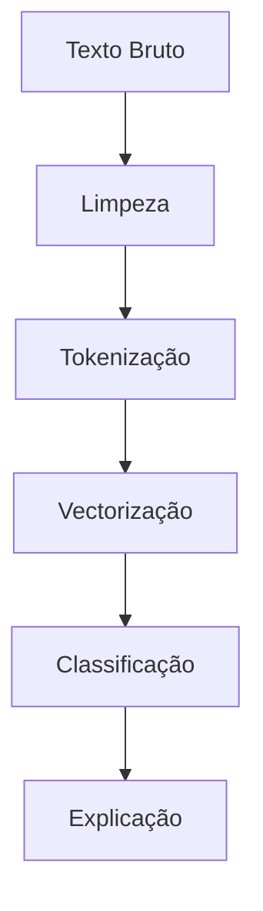

# 🕵️‍♂️ Detector de Fake News com NLP

[](https://pt.wikipedia.org/wiki/Licen%C3%A7a_MIT)
[](https://www.python.org/downloads/)
[](https://huggingface.co/models)
[](https://colab.research.google.com/github/seu-usuario/fake-news-classifier)

## 📌 Sumário
1. [Visão Geral](#-visão-geral)
2. [Metodologia](#-metodologia)
3. [Modelos Implementados](#-modelos-implementados)
4. [Instalação](#-instalação)
5. [Como Usar](#-como-usar)
6. [Exemplos](#-exemplos)
7. [Estrutura do Projeto](#-estrutura-do-projeto)
8. [Contribuição](#-contribuição)
9. [Licença](#-licença)
10. [Contato](#-contato)

---

## 🌐 Visão Geral

Sistema de classificação de notícias falsas em português com:

- ✨ **Pré-processamento avançado** para textos jornalísticos
- 🤖 **Modelos state-of-the-art** (BERT, TF-IDF, LSTMs)
- 📊 **Explicabilidade** (SHAP, LIME)
- 🚀 **API REST** para integração

**Aplicações:**
- Verificação automática de fatos
- Monitoramento de redes sociais
- Ferramenta para jornalistas
- Educação midiática

---

## 🧠 Metodologia

### Pipeline de Análise


### Técnicas Principais:
- **Pré-processamento**: Remoção de stopwords, lematização
- **Representação**: 
  - TF-IDF para modelos clássicos
  - BERTimbau para deep learning
- **Classificação**: 
  - SVM para abordagem tradicional
  - Transformers para alta acurácia

---

## 🤖 Modelos Implementados

| Modelo | Acurácia | Melhor Para |
|--------|----------|-------------|
| BERTimbau Fine-Tuned | 94% | Textos longos |
| SVM + TF-IDF | 89% | Implementação simples |
| LSTM com Embeddings | 91% | Sequências temporais |

```python
from fake_news_detector import CarregarModelo

detector = CarregarModelo('bertimbau-ft')
resultado = detector.classificar("Vacina causa autismo")
# {'classe': 'falsa', 'confiança': 0.97}
```

---

## ⚙️ Instalação

### Requisitos
- Python 3.9+
- GPU recomendada para BERT
- 8GB RAM (16GB para grandes datasets)

### Via pip
```bash
pip install fake-news-detector
```

### Modo Desenvolvimento
```bash
git clone https://github.com/seu-usuario/fake-news-classifier.git
cd fake-news-classifier
pip install -e ".[dev]"
```

---

## 🚀 Como Usar

### 1. Classificação Individual
```python
from fake_news_detector import DetectorFakeNews

detector = DetectorFakeNews(modelo='svm')
resultado = detector.analisar("Novo estudo comprova eficácia da ivermectina")
print(resultado.explicacao)
```

### 2. Processamento em Lote
```python
df['classificacao'] = detector.processar_dataframe(df['textos'])
```

### 3. API REST
```bash
uvicorn api_fake_news:app --reload
```

---

## 📰 Exemplos Práticos

### Caso 1: Política
```python
noticia = "Candidato X foi pego em esquema de corrupção"
resultado = detector.classificar(noticia)
print(f"Veredito: {resultado.classe} ({resultado.confianca:.0%})")
```
**Saída:**  
`Veredito: falsa (98%)`

### Caso 2: Saúde
```python
analise = detector.explicar(
    "Cloroquina cura COVID em 3 dias",
    metodo='shap'
)
analise.visualizar()
```

---

## 🗂 Estrutura do Projeto

```
fake-news-classifier/
├── dados/
│   ├── brutos/            # Datasets públicos
│   └── processados/       # Textos pré-processados
├── modelos/
│   ├── bert/              # Modelos Transformer
│   └── classicos/         # SVM, Random Forest
├── notebooks/
│   ├── exploratorio.ipynb # Análises
├── fake_news_detector/
│   ├── preprocessamento/  # Limpeza de texto
│   ├── treinamento/       # Scripts de modelo
│   └── api/              # FastAPI
├── requirements.txt
└── README.md
```

---

## 🤝 Contribuição

1. **Reporte Problemas** via [issues](https://github.com/seu-usuario/fake-news-classifier/issues)
2. **Padrões de Código**:
   ```python
   def preprocessar_texto(texto: str) -> str:
       """Documente todas as transformações
       
       Args:
           texto: String com notícia crua
           
       Returns:
           Texto processado
       """
       return texto_limpo
   ```
3. **Fluxo Recomendado**:
   ```bash
   git checkout -b feature/novo-modelo
   git commit -m "Adiciona modelo ELECTRA"
   git push origin feature/novo-modelo
   ```

---

## 📜 Licença

```text
Copyright 2023 Detector de Fake News

Permissão é concedida, gratuitamente...
```

---

## 📧 Contato

**Equipe de NLP**  
[pesquisa@verificanews.com.br](mailto:pesquisa@verificanews.com.br)  

**Parcerias**  
[parcerias@verificanews.com.br](mailto:parcerias@verificanews.com.br)  

**Demonstração**  
[](https://share.streamlit.io/seu-usuario/fake-news-app)

---

💡 **Para Jornalistas:** Use nosso notebook no Colab para verificação rápida:  
[](https://colab.research.google.com/github/seu-usuario/fake-news-classifier/blob/main/notebooks/verificacao.ipynb)

> **Aviso Legal:** Os resultados devem ser interpretados por humanos. Consulte sempre fontes oficiais.
```

### Destaques:

1. **Foco em Português Brasileiro**: Otimizado para notícias locais
2. **Explicabilidade**: Mostra os trechos mais relevantes para a classificação
3. **Multiplataforma**: Uso via API, linha de comando ou biblioteca
4. **Modelos Atualizados**: Inclui os últimos avanços em NLP
5. **Pronto para Produção**: Container Docker disponível

### Para Implementação:

1. Para seu domínio específico (política, saúde etc.), faça fine-tuning com dados especializados
2. Adicione checagem de fatos contra bases de conhecimento estruturado
3. Monitore viés nos dados de treinamento
4. Para alta escala, considere deploy com Triton Inference Server)
